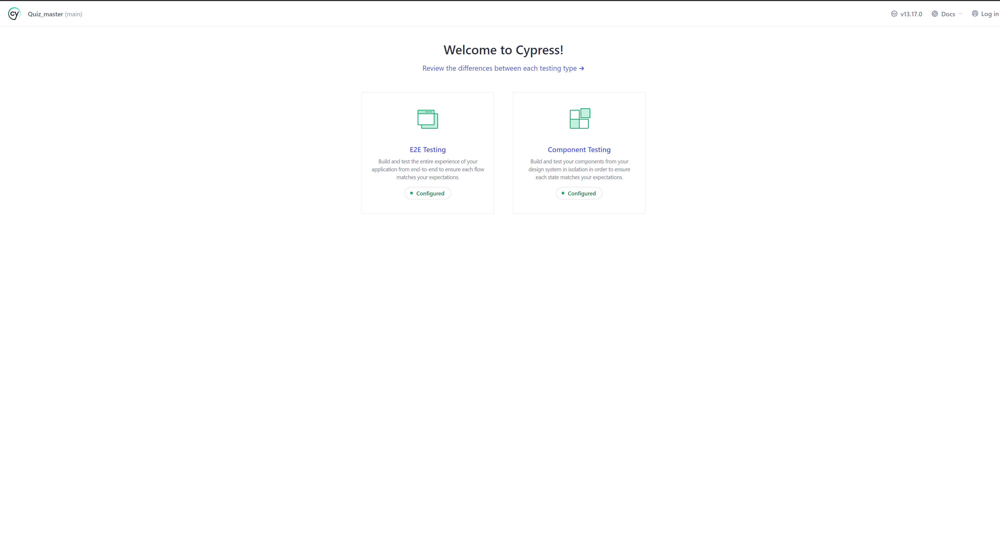
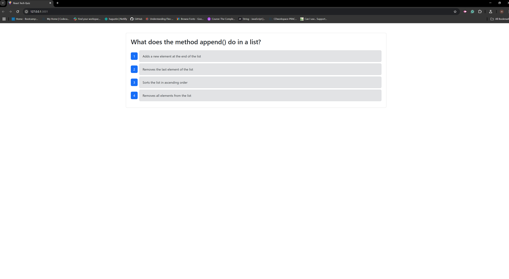
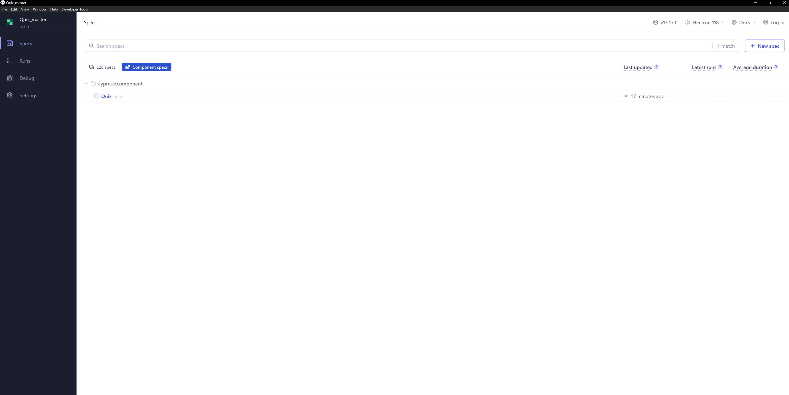
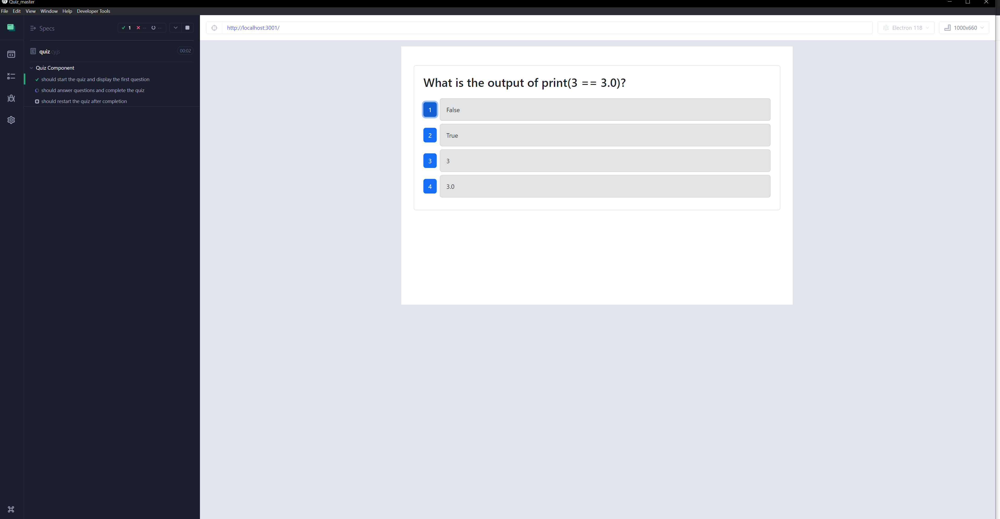

# Quiz Master 🎮✨

Welcome to **Quiz Master**, a MERN stack-based application that lets users take a quiz of ten random tech-related questions to test their knowledge and improve their skills. This project enhances the existing application with robust testing using **Cypress** for both **component testing** and **end-to-end (E2E) testing**.

---

## Table of Contents
- [Project Description](#project-description)
- [Features](#features)
- [Technologies Used](#technologies-used)
- [Setup and Installation](#setup-and-installation)
- [Testing with Cypress](#testing-with-cypress)
  - [Component Testing](#component-testing)
  - [End-to-End Testing](#end-to-end-testing)
- [Walkthrough Video](#walkthrough-video)
- [Screenshots](#screenshots)
- [Folder Structure](#folder-structure)
- [User Story](#user-story)
- [Acceptance Criteria](#acceptance-criteria)
- [Acknowledgments](#acknowledgments)

---

## Project Description

**Quiz Master** allows users to:
- Start a quiz with ten randomly selected tech questions.
- Answer questions and view their progress.
- See their final score upon completing the quiz.
- Restart the quiz to try again.

This project highlights the importance of **testing** in modern web applications to ensure reliability and robustness. Using Cypress, comprehensive tests validate the functionality of the application’s components and end-to-end workflows.

---

## Features

- ✅ Start a tech quiz with randomized questions.
- ✅ Dynamic display of questions and answers.
- ✅ Automatic scoring system.
- ✅ Option to restart the quiz after completion.
- ✅ Robust testing with Cypress for component and E2E tests.

---

## Technologies Used

- **Frontend**: React (TypeScript), Bootstrap
- **Backend**: Node.js, Express.js
- **Database**: MongoDB
- **Testing**: Cypress

---

## Setup and Installation

1. **Clone the Repository**:
```bash
   git clone https://github.com/Hagustin/Quiz_master.git
   cd Quiz_master
```

2. **Install Dependencies and build dist folder**:
```bash
   npm install
   npm run build
```

3. **Set Up Environment Variables**:
   - Rename `.env.example` to `.env`.
   - Add the required environment variables.

   **Note**: Ensure your MongoDB Compass is open and connected to the database specified in your `.env` file.

4. **Run the Application**:
```bash
   npm run start:dev
```

5. **Seed the Database**:
```bash
   npm run seed
```

5. **Run Cypress Tests**:
```bash
   npm run cypress
```

---

## Testing with Cypress

### Component Testing
- **Tested Component**: `Quiz`
- Verifies the quiz functionality in isolation:
  - Starting the quiz.
  - Displaying questions.
  - Answering questions.
  - Completing and restarting the quiz.

### End-to-End Testing
- Tests the full workflow of the application:
  - Starting the quiz.
  - Answering all questions.
  - Viewing the final score.
  - Restarting the quiz.

---

## Walkthrough Video

🎥 **[Link to Walkthrough Video](#)**

The video demonstrates:
1. Application functionality.
2. Cypress tests for both component and end-to-end testing.
3. Passing tests in the Cypress Test Runner.

---

## Screenshots

### Application



### Cypress Tests



---

## Folder Structure

```
.
├── client/                 // React frontend application
├── server/                 // Node.js/Express backend application
├── cypress/                // Cypress test folder
    ├── component/          // Component tests
        └── Quiz.cy.jsx     // Tests for the Quiz component
    ├── e2e/                // End-to-end tests
        └── quiz.cy.js      // Tests for the entire workflow
    ├── fixtures/           // Mock data for tests
        └── questions.json  // Mock quiz questions
    └── support/            // Cypress support files
├── .gitignore
├── cypress.config.ts       // Cypress configuration
├── package.json
├── README.md               // Project README
└── tsconfig.json           // TypeScript configuration
```

---

## User Story

> **AS AN** aspiring developer
> **I WANT** to take a tech quiz
> **SO THAT** I can test my knowledge and improve my skills

---

## Acceptance Criteria

- **Start the Quiz**: The quiz starts when the "Start Quiz" button is clicked.
- **Answer Questions**: Users are presented with a new question after each answer.
- **Quiz Completion**: The score is displayed when all questions are answered.
- **Restart Quiz**: Users can restart the quiz after completion.

---

## Acknowledgments

Special thanks to the instructional staff and peers for their guidance and support throughout this project.

---